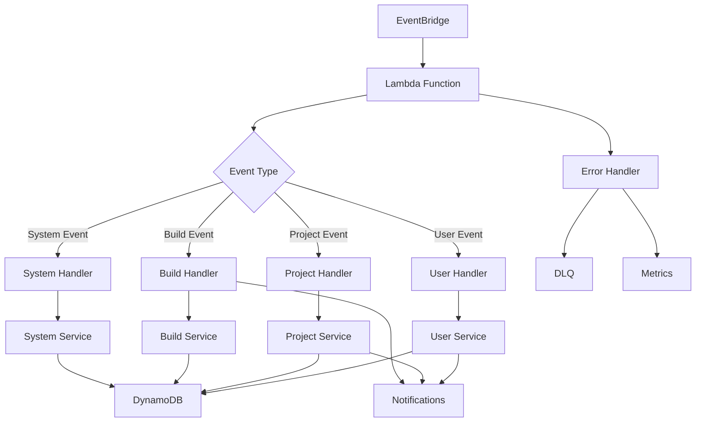

# Event Handler - AWS Lambda Function

A serverless event processing Lambda function built with TypeScript and AWS SDK, demonstrating event-driven architecture patterns, asynchronous processing, and integration with AWS services like EventBridge, DynamoDB, and SQS.

## Overview

This Lambda function provides a comprehensive example of:
- **Event-Driven Architecture**: Processing events from EventBridge
- **AWS SDK Integration**: Working with DynamoDB, S3, SQS, and other AWS services
- **Asynchronous Processing**: Handling concurrent event processing
- **Error Handling**: Robust error handling with retry logic and DLQ
- **Performance Optimization**: Efficient Lambda execution patterns
- **Observability**: Comprehensive logging and monitoring
- **Event Sourcing**: Storing events for audit and replay capabilities

## Quick Start

### Prerequisites

- Node.js 20+
- pnpm 9+
- AWS CLI configured
- LocalStack (for local development)
- Docker (for LocalStack)

### Local Development

```bash
# Install dependencies (from root)
pnpm install

# Start LocalStack services
pnpm local:up

# Bootstrap LocalStack resources
pnpm local:bootstrap

# Build the function
pnpm nx build event-handler

# Run locally with sample event
pnpm nx run event-handler:invoke --event=sample-event.json

# Deploy to LocalStack
pnpm nx run event-handler:deploy:local
```

### Test Event Processing

```bash
# Publish test event to EventBridge
aws --endpoint-url=http://localhost:4566 events put-events \
  --entries '[{
    "Source": "api-example",
    "DetailType": "User Created",
    "Detail": "{\"userId\": \"user-123\", \"email\": \"test@example.com\"}"
  }]'

# Check function logs
aws --endpoint-url=http://localhost:4566 logs tail /aws/lambda/event-handler --follow
```

## Architecture

### Project Structure

```
apps/event-handler/
├── src/
│   ├── handlers/               # Event handlers
│   │   ├── user-events.ts     # User-related events
│   │   ├── project-events.ts  # Project-related events
│   │   ├── build-events.ts    # Build-related events
│   │   └── system-events.ts   # System events
│   ├── services/              # Business logic services
│   │   ├── user.service.ts    # User operations
│   │   ├── project.service.ts # Project operations
│   │   ├── notification.service.ts # Notifications
│   │   └── audit.service.ts   # Audit logging
│   ├── utils/                 # Utility functions
│   │   ├── logger.ts          # Logging utilities
│   │   ├── metrics.ts         # CloudWatch metrics
│   │   ├── validation.ts      # Event validation
│   │   └── retry.ts           # Retry logic
│   ├── types/                 # TypeScript type definitions
│   │   ├── events.ts          # Event type definitions
│   │   └── aws.ts             # AWS service types
│   ├── config/                # Configuration
│   │   ├── aws.config.ts      # AWS client configuration
│   │   └── app.config.ts      # Application configuration
│   └── main.ts                # Lambda entry point
├── events/                    # Sample events for testing
│   ├── user-created.json
│   ├── project-updated.json
│   └── build-completed.json
├── serverless.yml             # Serverless framework config
├── project.json               # NX project configuration
└── README.md                  # This file
```

### Event Processing Flow



### Supported Event Types

The Lambda function processes various event types:

#### User Events
- `com.nx-monorepo.user.created`
- `com.nx-monorepo.user.updated`
- `com.nx-monorepo.user.deleted`
- `com.nx-monorepo.user.login`

#### Project Events
- `com.nx-monorepo.project.created`
- `com.nx-monorepo.project.updated`
- `com.nx-monorepo.project.deleted`
- `com.nx-monorepo.project.archived`

#### Build Events
- `com.nx-monorepo.build.started`
- `com.nx-monorepo.build.completed`
- `com.nx-monorepo.build.failed`
- `com.nx-monorepo.build.cancelled`

#### System Events
- `com.nx-monorepo.system.health-check`
- `com.nx-monorepo.system.maintenance`
- `com.nx-monorepo.system.alert`

## Implementation

### Main Handler

```typescript
// src/main.ts
import { EventBridgeEvent, Context } from 'aws-lambda';
import { Logger } from './utils/logger';
import { MetricsService } from './utils/metrics';
import { EventProcessor } from './services/event-processor';

const logger = new Logger('EventHandler');
const metrics = new MetricsService();
const eventProcessor = new EventProcessor();

export const handler = async (
  event: EventBridgeEvent<string, any>,
  context: Context
): Promise<void> => {
  const correlationId = context.awsRequestId;
  logger.setCorrelationId(correlationId);

  try {
    logger.info('Processing event', {
      eventType: event['detail-type'],
      source: event.source,
      eventId: event.id,
    });

    // Start processing timer
    const startTime = Date.now();

    // Process the event
    await eventProcessor.process(event);

    // Record success metrics
    const duration = Date.now() - startTime;
    await metrics.recordEventProcessed(event['detail-type'], duration, 'success');

    logger.info('Event processed successfully', {
      eventType: event['detail-type'],
      duration,
    });

  } catch (error) {
    logger.error('Failed to process event', {
      eventType: event['detail-type'],
      error: error.message,
      stack: error.stack,
    });

    // Record failure metrics
    await metrics.recordEventProcessed(event['detail-type'], 0, 'failure');

    // Re-throw to trigger Lambda retry/DLQ
    throw error;
  }
};
```

### Event Processor

```typescript
// src/services/event-processor.ts
import { EventBridgeEvent } from 'aws-lambda';
import { UserEventHandler } from '../handlers/user-events';
import { ProjectEventHandler } from '../handlers/project-events';
import { BuildEventHandler } from '../handlers/build-events';
import { SystemEventHandler } from '../handlers/system-events';
import { Logger } from '../utils/logger';

export class EventProcessor {
  private readonly logger = new Logger('EventProcessor');
  private readonly userHandler = new UserEventHandler();
  private readonly projectHandler = new ProjectEventHandler();
  private readonly buildHandler = new BuildEventHandler();
  private readonly systemHandler = new SystemEventHandler();

  async process(event: EventBridgeEvent<string, any>): Promise<void> {
    const eventType = event['detail-type'];
    const source = event.source;

    this.logger.info('Routing event', { eventType, source });

    // Route based on event type
    if (eventType.includes('user')) {
      await this.userHandler.handle(event);
    } else if (eventType.includes('project')) {
      await this.projectHandler.handle(event);
    } else if (eventType.includes('build')) {
      await this.buildHandler.handle(event);
    } else if (eventType.includes('system')) {
      await this.systemHandler.handle(event);
    } else {
      throw new Error(`Unsupported event type: ${eventType}`);
    }
  }
}
```

### User Event Handler

```typescript
// src/handlers/user-events.ts
import { EventBridgeEvent } from 'aws-lambda';
import { UserService } from '../services/user.service';
import { NotificationService } from '../services/notification.service';
import { AuditService } from '../services/audit.service';
import { Logger } from '../utils/logger';
import { validateEvent } from '../utils/validation';
import { UserCreatedEvent, UserUpdatedEvent } from '../types/events';

export class UserEventHandler {
  private readonly logger = new Logger('UserEventHandler');
  private readonly userService = new UserService();
  private readonly notificationService = new NotificationService();
  private readonly auditService = new AuditService();

  async handle(event: EventBridgeEvent<string, any>): Promise<void> {
    const eventType = event['detail-type'];

    switch (eventType) {
      case 'com.nx-monorepo.user.created':
        await this.handleUserCreated(event);
        break;
      case 'com.nx-monorepo.user.updated':
        await this.handleUserUpdated(event);
        break;
      case 'com.nx-monorepo.user.deleted':
        await this.handleUserDeleted(event);
        break;
      default:
        throw new Error(`Unsupported user event: ${eventType}`);
    }
  }

  private async handleUserCreated(
    event: EventBridgeEvent<'com.nx-monorepo.user.created', UserCreatedEvent>
  ): Promise<void> {
    // Validate event structure
    const validatedEvent = validateEvent(event, 'user.created');

    const { userId, email, name } = validatedEvent.detail;

    this.logger.info('Processing user created event', { userId, email });

    try {
      // Store user data in DynamoDB
      await this.userService.createUserProfile(userId, {
        email,
        name,
        createdAt: new Date().toISOString(),
        status: 'active',
      });

      // Send welcome email
      await this.notificationService.sendWelcomeEmail(email, name);

      // Log audit event
      await this.auditService.log({
        eventType: 'user.created',
        userId,
        timestamp: new Date().toISOString(),
        details: { email, name },
      });

      // Emit analytics event
      await this.userService.trackUserRegistration(userId, {
        email,
        registrationDate: new Date().toISOString(),
      });

      this.logger.info('User created event processed successfully', { userId });

    } catch (error) {
      this.logger.error('Failed to process user created event', {
        userId,
        error: error.message,
      });
      throw error;
    }
  }

  private async handleUserUpdated(
    event: EventBridgeEvent<'com.nx-monorepo.user.updated', UserUpdatedEvent>
  ): Promise<void> {
    const { userId, changes } = event.detail;

    this.logger.info('Processing user updated event', { userId, changes });

    try {
      // Update user profile
      await this.userService.updateUserProfile(userId, changes);

      // Send notification if email changed
      if (changes.email) {
        await this.notificationService.sendEmailChangeNotification(
          changes.email.old,
          changes.email.new
        );
      }

      // Log audit event
      await this.auditService.log({
        eventType: 'user.updated',
        userId,
        timestamp: new Date().toISOString(),
        details: { changes },
      });

      this.logger.info('User updated event processed successfully', { userId });

    } catch (error) {
      this.logger.error('Failed to process user updated event', {
        userId,
        error: error.message,
      });
      throw error;
    }
  }

  private async handleUserDeleted(event: EventBridgeEvent<string, any>): Promise<void> {
    const { userId } = event.detail;

    this.logger.info('Processing user deleted event', { userId });

    try {
      // Soft delete user data
      await this.userService.deleteUserProfile(userId);

      // Clean up user sessions
      await this.userService.invalidateUserSessions(userId);

      // Log audit event
      await this.auditService.log({
        eventType: 'user.deleted',
        userId,
        timestamp: new Date().toISOString(),
        details: { deletedAt: new Date().toISOString() },
      });

      this.logger.info('User deleted event processed successfully', { userId });

    } catch (error) {
      this.logger.error('Failed to process user deleted event', {
        userId,
        error: error.message,
      });
      throw error;
    }
  }
}
```

### Build Event Handler

```typescript
// src/handlers/build-events.ts
import { EventBridgeEvent } from 'aws-lambda';
import { BuildService } from '../services/build.service';
import { NotificationService } from '../services/notification.service';
import { Logger } from '../utils/logger';
import { BuildCompletedEvent, BuildFailedEvent } from '../types/events';

export class BuildEventHandler {
  private readonly logger = new Logger('BuildEventHandler');
  private readonly buildService = new BuildService();
  private readonly notificationService = new NotificationService();

  async handle(event: EventBridgeEvent<string, any>): Promise<void> {
    const eventType = event['detail-type'];

    switch (eventType) {
      case 'com.nx-monorepo.build.started':
        await this.handleBuildStarted(event);
        break;
      case 'com.nx-monorepo.build.completed':
        await this.handleBuildCompleted(event);
        break;
      case 'com.nx-monorepo.build.failed':
        await this.handleBuildFailed(event);
        break;
      default:
        throw new Error(`Unsupported build event: ${eventType}`);
    }
  }

  private async handleBuildCompleted(
    event: EventBridgeEvent<'com.nx-monorepo.build.completed', BuildCompletedEvent>
  ): Promise<void> {
    const { buildId, projectId, duration, artifacts } = event.detail;

    this.logger.info('Processing build completed event', { buildId, projectId });

    try {
      // Update build status in database
      await this.buildService.updateBuildStatus(buildId, {
        status: 'completed',
        completedAt: new Date().toISOString(),
        duration,
        artifacts,
      });

      // Trigger deployment if configured
      const project = await this.buildService.getProject(projectId);
      if (project.autoDeployment) {
        await this.buildService.triggerDeployment(buildId, project.environment);
      }

      // Send success notification
      await this.notificationService.sendBuildSuccessNotification(
        project.owner,
        project.name,
        buildId,
        duration
      );

      // Update project metrics
      await this.buildService.updateProjectMetrics(projectId, {
        lastSuccessfulBuild: new Date().toISOString(),
        successfulBuilds: { $inc: 1 },
        averageBuildTime: duration,
      });

      this.logger.info('Build completed event processed successfully', { buildId });

    } catch (error) {
      this.logger.error('Failed to process build completed event', {
        buildId,
        error: error.message,
      });
      throw error;
    }
  }

  private async handleBuildFailed(
    event: EventBridgeEvent<'com.nx-monorepo.build.failed', BuildFailedEvent>
  ): Promise<void> {
    const { buildId, projectId, error, failedStep } = event.detail;

    this.logger.info('Processing build failed event', { buildId, projectId });

    try {
      // Update build status
      await this.buildService.updateBuildStatus(buildId, {
        status: 'failed',
        failedAt: new Date().toISOString(),
        error,
        failedStep,
      });

      // Send failure notification
      const project = await this.buildService.getProject(projectId);
      await this.notificationService.sendBuildFailureNotification(
        project.owner,
        project.name,
        buildId,
        error
      );

      // Update failure metrics
      await this.buildService.updateProjectMetrics(projectId, {
        lastFailedBuild: new Date().toISOString(),
        failedBuilds: { $inc: 1 },
      });

      // Create incident if multiple consecutive failures
      const recentFailures = await this.buildService.getRecentFailures(projectId, 5);
      if (recentFailures.length >= 3) {
        await this.buildService.createIncident(projectId, {
          type: 'consecutive_build_failures',
          severity: 'high',
          description: `Project has ${recentFailures.length} consecutive build failures`,
        });
      }

      this.logger.info('Build failed event processed successfully', { buildId });

    } catch (error) {
      this.logger.error('Failed to process build failed event', {
        buildId,
        error: error.message,
      });
      throw error;
    }
  }
}
```

## Services

### User Service

```typescript
// src/services/user.service.ts
import { DynamoDBClient } from '@aws-sdk/client-dynamodb';
import { DynamoDBDocumentClient, PutCommand, UpdateCommand, DeleteCommand } from '@aws-sdk/lib-dynamodb';
import { Logger } from '../utils/logger';

export class UserService {
  private readonly dynamodb: DynamoDBDocumentClient;
  private readonly logger = new Logger('UserService');
  private readonly tableName = process.env.USERS_TABLE || 'nx-users';

  constructor() {
    const client = new DynamoDBClient({
      region: process.env.AWS_REGION || 'us-east-1',
      endpoint: process.env.AWS_ENDPOINT_URL, // For LocalStack
    });
    this.dynamodb = DynamoDBDocumentClient.from(client);
  }

  async createUserProfile(userId: string, userData: any): Promise<void> {
    const item = {
      userId,
      ...userData,
      createdAt: new Date().toISOString(),
      updatedAt: new Date().toISOString(),
    };

    const command = new PutCommand({
      TableName: this.tableName,
      Item: item,
      ConditionExpression: 'attribute_not_exists(userId)',
    });

    try {
      await this.dynamodb.send(command);
      this.logger.info('User profile created', { userId });
    } catch (error) {
      this.logger.error('Failed to create user profile', { userId, error: error.message });
      throw error;
    }
  }

  async updateUserProfile(userId: string, changes: any): Promise<void> {
    const updateExpression = this.buildUpdateExpression(changes);
    const expressionAttributeValues = this.buildExpressionAttributeValues(changes);

    const command = new UpdateCommand({
      TableName: this.tableName,
      Key: { userId },
      UpdateExpression: updateExpression,
      ExpressionAttributeValues: expressionAttributeValues,
      ConditionExpression: 'attribute_exists(userId)',
    });

    try {
      await this.dynamodb.send(command);
      this.logger.info('User profile updated', { userId, changes });
    } catch (error) {
      this.logger.error('Failed to update user profile', { userId, error: error.message });
      throw error;
    }
  }

  async deleteUserProfile(userId: string): Promise<void> {
    // Soft delete by updating status
    const command = new UpdateCommand({
      TableName: this.tableName,
      Key: { userId },
      UpdateExpression: 'SET #status = :status, deletedAt = :deletedAt',
      ExpressionAttributeNames: {
        '#status': 'status',
      },
      ExpressionAttributeValues: {
        ':status': 'deleted',
        ':deletedAt': new Date().toISOString(),
      },
    });

    try {
      await this.dynamodb.send(command);
      this.logger.info('User profile deleted', { userId });
    } catch (error) {
      this.logger.error('Failed to delete user profile', { userId, error: error.message });
      throw error;
    }
  }

  private buildUpdateExpression(changes: any): string {
    const expressions = Object.keys(changes).map(key => `${key} = :${key}`);
    return `SET ${expressions.join(', ')}, updatedAt = :updatedAt`;
  }

  private buildExpressionAttributeValues(changes: any): any {
    const values = {};
    Object.keys(changes).forEach(key => {
      values[`:${key}`] = changes[key];
    });
    values[':updatedAt'] = new Date().toISOString();
    return values;
  }
}
```

### Notification Service

```typescript
// src/services/notification.service.ts
import { SESClient, SendEmailCommand } from '@aws-sdk/client-ses';
import { SNSClient, PublishCommand } from '@aws-sdk/client-sns';
import { Logger } from '../utils/logger';

export class NotificationService {
  private readonly ses: SESClient;
  private readonly sns: SNSClient;
  private readonly logger = new Logger('NotificationService');

  constructor() {
    const config = {
      region: process.env.AWS_REGION || 'us-east-1',
      endpoint: process.env.AWS_ENDPOINT_URL, // For LocalStack
    };

    this.ses = new SESClient(config);
    this.sns = new SNSClient(config);
  }

  async sendWelcomeEmail(email: string, name: string): Promise<void> {
    const command = new SendEmailCommand({
      Source: process.env.FROM_EMAIL || 'noreply@example.com',
      Destination: {
        ToAddresses: [email],
      },
      Message: {
        Subject: {
          Data: 'Welcome to NX Monorepo Platform',
        },
        Body: {
          Html: {
            Data: this.getWelcomeEmailTemplate(name),
          },
          Text: {
            Data: `Welcome ${name}! Thank you for joining our platform.`,
          },
        },
      },
    });

    try {
      await this.ses.send(command);
      this.logger.info('Welcome email sent', { email });
    } catch (error) {
      this.logger.error('Failed to send welcome email', { email, error: error.message });
      throw error;
    }
  }

  async sendBuildSuccessNotification(
    userId: string,
    projectName: string,
    buildId: string,
    duration: number
  ): Promise<void> {
    const message = {
      type: 'build_success',
      userId,
      projectName,
      buildId,
      duration,
      timestamp: new Date().toISOString(),
    };

    await this.publishToSNS('build-notifications', message);
  }

  async sendBuildFailureNotification(
    userId: string,
    projectName: string,
    buildId: string,
    error: string
  ): Promise<void> {
    const message = {
      type: 'build_failure',
      userId,
      projectName,
      buildId,
      error,
      timestamp: new Date().toISOString(),
    };

    await this.publishToSNS('build-notifications', message);
  }

  private async publishToSNS(topicName: string, message: any): Promise<void> {
    const topicArn = process.env[`${topicName.toUpperCase()}_TOPIC_ARN`];

    if (!topicArn) {
      this.logger.warn('SNS topic ARN not configured', { topicName });
      return;
    }

    const command = new PublishCommand({
      TopicArn: topicArn,
      Message: JSON.stringify(message),
      MessageAttributes: {
        messageType: {
          DataType: 'String',
          StringValue: message.type,
        },
      },
    });

    try {
      await this.sns.send(command);
      this.logger.info('SNS message published', { topicName, messageType: message.type });
    } catch (error) {
      this.logger.error('Failed to publish SNS message', {
        topicName,
        error: error.message,
      });
      throw error;
    }
  }

  private getWelcomeEmailTemplate(name: string): string {
    return `
      <html>
        <body>
          <h1>Welcome ${name}!</h1>
          <p>Thank you for joining our NX Monorepo Platform.</p>
          <p>Get started by:</p>
          <ul>
            <li>Creating your first project</li>
            <li>Setting up your development environment</li>
            <li>Exploring our documentation</li>
          </ul>
          <p>If you have any questions, feel free to reach out to our support team.</p>
        </body>
      </html>
    `;
  }
}
```

## Configuration

### Environment Variables

```bash
# AWS Configuration
AWS_REGION=us-east-1
AWS_ENDPOINT_URL=http://localhost:4566  # LocalStack only

# DynamoDB Tables
USERS_TABLE=nx-users
PROJECTS_TABLE=nx-projects
BUILDS_TABLE=nx-builds
AUDIT_TABLE=nx-audit

# EventBridge
EVENT_BUS_NAME=nx-monorepo-events

# SNS Topics
BUILD_NOTIFICATIONS_TOPIC_ARN=arn:aws:sns:us-east-1:123456789012:build-notifications

# SES Configuration
FROM_EMAIL=noreply@example.com

# Logging
LOG_LEVEL=info
ENABLE_METRICS=true

# Function Configuration
TIMEOUT=30
MEMORY_SIZE=512
RESERVED_CONCURRENCY=100
```

### Serverless Configuration

```yaml
# serverless.yml
service: nx-event-handler
frameworkVersion: '3'

provider:
  name: aws
  runtime: nodejs20.x
  region: ${env:AWS_REGION, 'us-east-1'}
  memorySize: ${env:MEMORY_SIZE, 512}
  timeout: ${env:TIMEOUT, 30}

  environment:
    NODE_ENV: ${env:NODE_ENV, 'production'}
    LOG_LEVEL: ${env:LOG_LEVEL, 'info'}
    USERS_TABLE: ${self:custom.usersTable}
    PROJECTS_TABLE: ${self:custom.projectsTable}
    BUILDS_TABLE: ${self:custom.buildsTable}

  iam:
    role:
      statements:
        - Effect: Allow
          Action:
            - dynamodb:GetItem
            - dynamodb:PutItem
            - dynamodb:UpdateItem
            - dynamodb:DeleteItem
            - dynamodb:Query
            - dynamodb:Scan
          Resource:
            - arn:aws:dynamodb:${aws:region}:${aws:accountId}:table/${self:custom.usersTable}
            - arn:aws:dynamodb:${aws:region}:${aws:accountId}:table/${self:custom.projectsTable}
            - arn:aws:dynamodb:${aws:region}:${aws:accountId}:table/${self:custom.buildsTable}
        - Effect: Allow
          Action:
            - ses:SendEmail
            - ses:SendRawEmail
          Resource: "*"
        - Effect: Allow
          Action:
            - sns:Publish
          Resource: "*"

functions:
  eventHandler:
    handler: dist/main.handler
    reservedConcurrency: ${env:RESERVED_CONCURRENCY, 100}
    events:
      - eventBridge:
          eventBus: ${env:EVENT_BUS_NAME, 'nx-monorepo-events'}
          pattern:
            source:
              - api-example
              - build-system
              - deployment-system
            detail-type:
              - prefix: "com.nx-monorepo."
    deadLetter:
      targetArn: !GetAtt EventHandlerDLQ.Arn
    onError: !GetAtt EventHandlerDLQ.Arn

resources:
  Resources:
    EventHandlerDLQ:
      Type: AWS::SQS::Queue
      Properties:
        QueueName: ${self:service}-${self:provider.stage}-dlq
        MessageRetentionPeriod: 1209600  # 14 days

custom:
  usersTable: ${self:service}-${self:provider.stage}-users
  projectsTable: ${self:service}-${self:provider.stage}-projects
  buildsTable: ${self:service}-${self:provider.stage}-builds
```

## Testing

### Running Tests

```bash
# Unit tests
pnpm nx test event-handler

# Integration tests with LocalStack
pnpm nx run event-handler:test:integration

# End-to-end tests
pnpm nx run event-handler:test:e2e

# Coverage report
pnpm nx test event-handler --coverage
```

### Test Structure

```
test/
├── unit/                       # Unit tests
│   ├── handlers/              # Handler tests
│   ├── services/              # Service tests
│   └── utils/                 # Utility tests
├── integration/               # Integration tests
│   ├── event-processing.spec.ts
│   ├── dynamodb.spec.ts
│   └── sns.spec.ts
├── e2e/                       # End-to-end tests
│   └── event-flow.spec.ts
├── fixtures/                  # Test data
│   ├── events/
│   └── responses/
└── helpers/                   # Test utilities
    ├── aws-mock.ts
    └── event-generator.ts
```

### Example Tests

#### Unit Test
```typescript
// test/unit/handlers/user-events.spec.ts
describe('UserEventHandler', () => {
  let handler: UserEventHandler;
  let userService: jest.Mocked<UserService>;
  let notificationService: jest.Mocked<NotificationService>;

  beforeEach(() => {
    userService = {
      createUserProfile: jest.fn(),
      updateUserProfile: jest.fn(),
      deleteUserProfile: jest.fn(),
    } as any;

    notificationService = {
      sendWelcomeEmail: jest.fn(),
    } as any;

    handler = new UserEventHandler();
    (handler as any).userService = userService;
    (handler as any).notificationService = notificationService;
  });

  describe('handleUserCreated', () => {
    it('should process user created event successfully', async () => {
      const event = {
        'detail-type': 'com.nx-monorepo.user.created',
        source: 'api-example',
        detail: {
          userId: 'user-123',
          email: 'test@example.com',
          name: 'Test User',
        },
      };

      await handler.handle(event as any);

      expect(userService.createUserProfile).toHaveBeenCalledWith('user-123', {
        email: 'test@example.com',
        name: 'Test User',
        createdAt: expect.any(String),
        status: 'active',
      });

      expect(notificationService.sendWelcomeEmail).toHaveBeenCalledWith(
        'test@example.com',
        'Test User'
      );
    });
  });
});
```

#### Integration Test
```typescript
// test/integration/event-processing.spec.ts
describe('Event Processing Integration', () => {
  beforeAll(async () => {
    // Setup LocalStack
    await setupLocalStack();
    await createTestTables();
  });

  afterAll(async () => {
    await cleanupLocalStack();
  });

  it('should process user created event end-to-end', async () => {
    const event = {
      'detail-type': 'com.nx-monorepo.user.created',
      source: 'api-example',
      detail: {
        userId: 'user-123',
        email: 'test@example.com',
        name: 'Test User',
      },
    };

    // Invoke handler
    await handler(event, mockContext);

    // Verify DynamoDB record
    const user = await dynamodb.send(new GetCommand({
      TableName: 'nx-users',
      Key: { userId: 'user-123' },
    }));

    expect(user.Item).toMatchObject({
      userId: 'user-123',
      email: 'test@example.com',
      name: 'Test User',
      status: 'active',
    });
  });
});
```

### Local Testing

```bash
# Test with sample events
pnpm nx run event-handler:invoke --event=events/user-created.json

# Test specific handler
pnpm nx run event-handler:test:handler --handler=userEvents

# Load testing
pnpm nx run event-handler:load-test --events=100
```

## Deployment

### Local Deployment (LocalStack)

```bash
# Deploy to LocalStack
pnpm nx run event-handler:deploy:local

# Update function code only
pnpm nx run event-handler:update:local

# View function logs
aws --endpoint-url=http://localhost:4566 logs tail /aws/lambda/event-handler --follow
```

### AWS Deployment

```bash
# Deploy to staging
pnpm nx run event-handler:deploy:staging

# Deploy to production
pnpm nx run event-handler:deploy:production

# Update function configuration
aws lambda update-function-configuration \
  --function-name nx-event-handler-production \
  --memory-size 1024 \
  --timeout 60
```

### Deployment Scripts

```bash
#!/bin/bash
# scripts/deploy.sh

set -e

ENVIRONMENT=${1:-staging}
VERSION=${2:-latest}

echo "Deploying event-handler to $ENVIRONMENT (version: $VERSION)"

# Build function
pnpm nx build event-handler --prod

# Package for deployment
cd dist/apps/event-handler
zip -r ../../../event-handler-$VERSION.zip . -x "*.map"

# Upload to S3
aws s3 cp event-handler-$VERSION.zip \
  s3://nx-lambda-deployments-$ENVIRONMENT/

# Update function code
aws lambda update-function-code \
  --function-name nx-event-handler-$ENVIRONMENT \
  --s3-bucket nx-lambda-deployments-$ENVIRONMENT \
  --s3-key event-handler-$VERSION.zip

# Update alias
LATEST_VERSION=$(aws lambda publish-version \
  --function-name nx-event-handler-$ENVIRONMENT \
  --query 'Version' --output text)

aws lambda update-alias \
  --function-name nx-event-handler-$ENVIRONMENT \
  --name LIVE \
  --function-version $LATEST_VERSION

echo "Deployment completed successfully"
```

## Monitoring and Observability

### CloudWatch Metrics

The function publishes custom metrics:

```typescript
// src/utils/metrics.ts
import { CloudWatchClient, PutMetricDataCommand } from '@aws-sdk/client-cloudwatch';

export class MetricsService {
  private readonly cloudwatch: CloudWatchClient;

  constructor() {
    this.cloudwatch = new CloudWatchClient({
      region: process.env.AWS_REGION || 'us-east-1',
    });
  }

  async recordEventProcessed(
    eventType: string,
    duration: number,
    status: 'success' | 'failure'
  ): Promise<void> {
    const command = new PutMetricDataCommand({
      Namespace: 'NXMonorepo/EventHandler',
      MetricData: [
        {
          MetricName: 'EventsProcessed',
          Value: 1,
          Unit: 'Count',
          Dimensions: [
            { Name: 'EventType', Value: eventType },
            { Name: 'Status', Value: status },
          ],
        },
        {
          MetricName: 'ProcessingDuration',
          Value: duration,
          Unit: 'Milliseconds',
          Dimensions: [
            { Name: 'EventType', Value: eventType },
          ],
        },
      ],
    });

    await this.cloudwatch.send(command);
  }
}
```

### Structured Logging

```typescript
// src/utils/logger.ts
export class Logger {
  private correlationId?: string;

  constructor(private readonly context: string) {}

  setCorrelationId(id: string): void {
    this.correlationId = id;
  }

  info(message: string, metadata?: any): void {
    console.log(JSON.stringify({
      level: 'info',
      timestamp: new Date().toISOString(),
      context: this.context,
      message,
      correlationId: this.correlationId,
      ...metadata,
    }));
  }

  error(message: string, metadata?: any): void {
    console.error(JSON.stringify({
      level: 'error',
      timestamp: new Date().toISOString(),
      context: this.context,
      message,
      correlationId: this.correlationId,
      ...metadata,
    }));
  }
}
```

### Alarms and Notifications

```yaml
# CloudFormation template for alarms
Resources:
  EventHandlerErrorAlarm:
    Type: AWS::CloudWatch::Alarm
    Properties:
      AlarmName: EventHandler-Errors
      AlarmDescription: Event handler function errors
      MetricName: Errors
      Namespace: AWS/Lambda
      Statistic: Sum
      Period: 300
      EvaluationPeriods: 2
      Threshold: 5
      ComparisonOperator: GreaterThanOrEqualToThreshold
      Dimensions:
        - Name: FunctionName
          Value: !Ref EventHandlerFunction
      AlarmActions:
        - !Ref AlertTopic

  EventHandlerDurationAlarm:
    Type: AWS::CloudWatch::Alarm
    Properties:
      AlarmName: EventHandler-Duration
      AlarmDescription: Event handler function duration
      MetricName: Duration
      Namespace: AWS/Lambda
      Statistic: Average
      Period: 300
      EvaluationPeriods: 2
      Threshold: 25000  # 25 seconds
      ComparisonOperator: GreaterThanThreshold
      Dimensions:
        - Name: FunctionName
          Value: !Ref EventHandlerFunction
      AlarmActions:
        - !Ref AlertTopic
```

## Error Handling and Retry Logic

### Error Handling Strategy

```typescript
// src/utils/retry.ts
export async function withRetry<T>(
  operation: () => Promise<T>,
  maxRetries = 3,
  backoffMs = 1000
): Promise<T> {
  let lastError: Error;

  for (let attempt = 1; attempt <= maxRetries; attempt++) {
    try {
      return await operation();
    } catch (error) {
      lastError = error;

      if (attempt === maxRetries) {
        throw error;
      }

      // Exponential backoff
      const delay = backoffMs * Math.pow(2, attempt - 1);
      await new Promise(resolve => setTimeout(resolve, delay));
    }
  }

  throw lastError!;
}
```

### Dead Letter Queue Processing

```typescript
// src/handlers/dlq-processor.ts
export const dlqHandler = async (event: SQSEvent): Promise<void> => {
  for (const record of event.Records) {
    try {
      const originalEvent = JSON.parse(record.body);

      // Log failed event for analysis
      console.error('Processing DLQ message', {
        originalEvent,
        receiptHandle: record.receiptHandle,
        attemptCount: record.attributes.ApproximateReceiveCount,
      });

      // Optionally attempt reprocessing or send to support queue
      await handleFailedEvent(originalEvent);

    } catch (error) {
      console.error('Failed to process DLQ message', {
        error: error.message,
        record,
      });
    }
  }
};
```

## Performance Optimization

### Lambda Configuration

```yaml
# Optimized Lambda configuration
functions:
  eventHandler:
    handler: dist/main.handler
    memorySize: 1024  # Increase for better CPU performance
    timeout: 30
    reservedConcurrency: 100
    provisioned:
      concurrency: 10  # Keep warm instances
    environment:
      NODE_OPTIONS: "--enable-source-maps"
    layers:
      - arn:aws:lambda:us-east-1:123456789012:layer:nodejs-runtime:1
```

### Connection Pooling

```typescript
// src/config/aws.config.ts
import { DynamoDBClient } from '@aws-sdk/client-dynamodb';

// Reuse clients across invocations
let dynamoClient: DynamoDBClient;

export function getDynamoClient(): DynamoDBClient {
  if (!dynamoClient) {
    dynamoClient = new DynamoDBClient({
      region: process.env.AWS_REGION,
      maxAttempts: 3,
      retryMode: 'adaptive',
    });
  }
  return dynamoClient;
}
```

### Batch Processing

```typescript
// Process multiple events in batches
export class BatchProcessor {
  async processBatch<T>(
    items: T[],
    processor: (item: T) => Promise<void>,
    batchSize = 25
  ): Promise<void> {
    for (let i = 0; i < items.length; i += batchSize) {
      const batch = items.slice(i, i + batchSize);
      await Promise.all(batch.map(processor));
    }
  }
}
```

## Troubleshooting

### Common Issues

#### Event Not Processing
```bash
# Check EventBridge rules
aws events list-rules --event-bus-name nx-monorepo-events

# Check function configuration
aws lambda get-function-configuration --function-name nx-event-handler

# Check function logs
aws logs tail /aws/lambda/nx-event-handler --follow
```

#### DynamoDB Permission Errors
```bash
# Check IAM role permissions
aws iam get-role-policy --role-name nx-event-handler-role --policy-name DynamoDBPolicy

# Test DynamoDB connectivity
aws dynamodb describe-table --table-name nx-users
```

#### Memory/Timeout Issues
```bash
# Monitor function metrics
aws cloudwatch get-metric-statistics \
  --namespace AWS/Lambda \
  --metric-name Duration \
  --dimensions Name=FunctionName,Value=nx-event-handler \
  --start-time 2024-01-01T00:00:00Z \
  --end-time 2024-01-02T00:00:00Z \
  --period 300 \
  --statistics Average,Maximum
```

### Debug Mode

```bash
# Enable debug logging
DEBUG=* pnpm nx run event-handler:invoke --event=events/debug-event.json

# Local debugging with VS Code
{
  "type": "node",
  "request": "launch",
  "name": "Debug Event Handler",
  "program": "${workspaceFolder}/dist/apps/event-handler/main.js",
  "env": {
    "NODE_ENV": "development",
    "LOG_LEVEL": "debug"
  }
}
```

## Contributing

See the main [CONTRIBUTING.md](../../CONTRIBUTING.md) for general guidelines.

### Event Handler Guidelines

1. **Event Validation**: Always validate event structure
2. **Idempotency**: Design handlers to be idempotent
3. **Error Handling**: Implement proper error handling and retry logic
4. **Monitoring**: Add metrics and logging for observability
5. **Testing**: Write comprehensive tests including integration tests
6. **Performance**: Optimize for cold start and execution time

---

**Last Updated**: January 15, 2024
**Version**: 1.0.0