# Architecture Diagrams and Flow Charts

This document contains visual representations of the system architecture, data flows, and key processes.

## System Overview Diagram

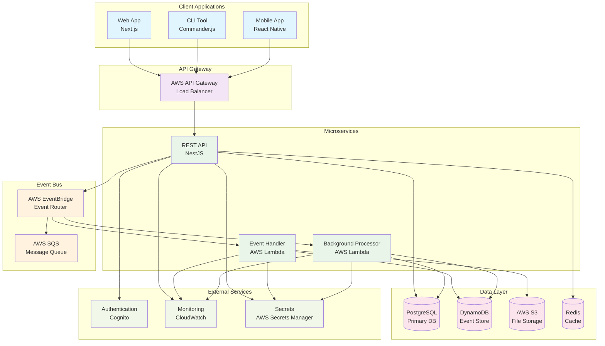

## Service Interaction Flow

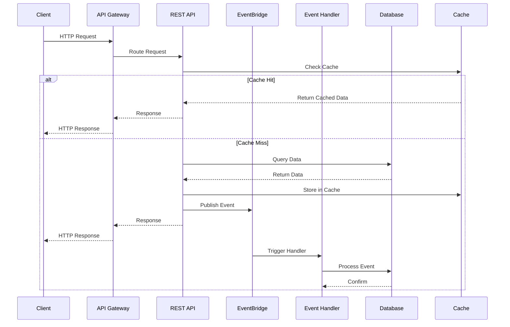

## Event-Driven Architecture Flow

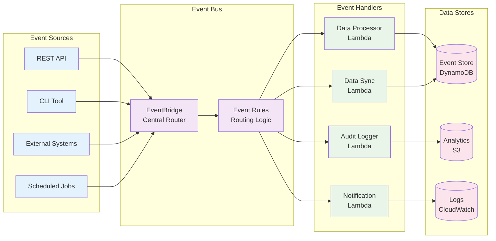

## Data Flow Architecture

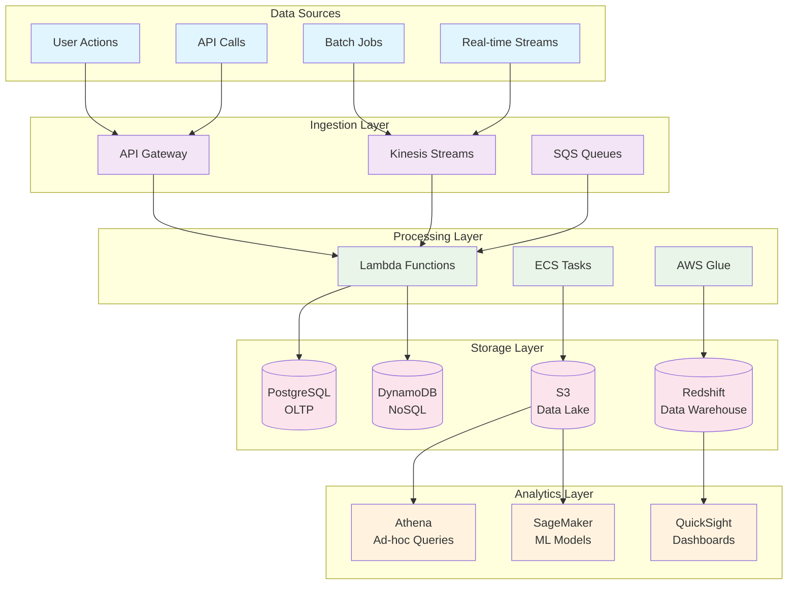

## Security Architecture

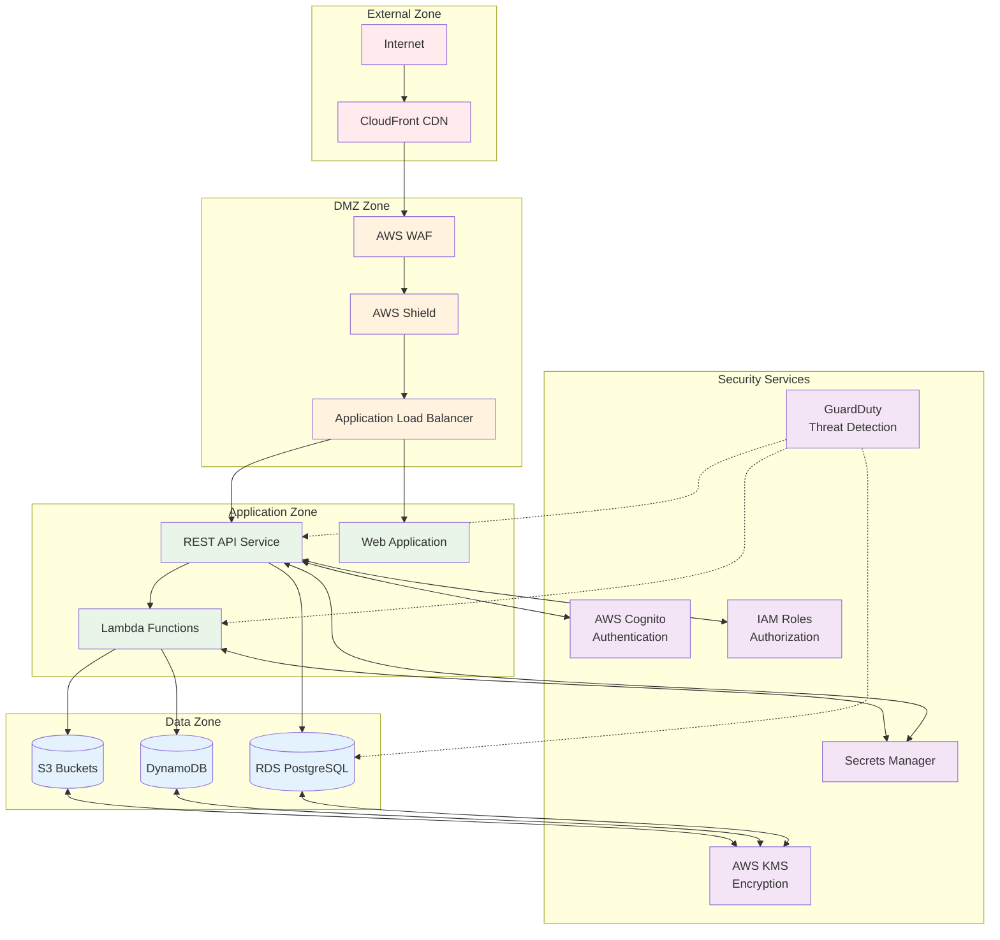

## CI/CD Pipeline Flow

```mermaid
graph LR
    subgraph "Development"
        DEV[Developer]
        IDE[IDE/DevContainer]
        LOCAL[Local Testing]
    end

    subgraph "Source Control"
        GIT[Git Repository]
        PR[Pull Request]
        REVIEW[Code Review]
    end

    subgraph "CI Pipeline"
        BUILD[Build & Test]
        LINT[Code Quality]
        SECURITY[Security Scan]
        ARTIFACT[Build Artifacts]
    end

    subgraph "CD Pipeline"
        STAGING[Deploy Staging]
        TEST[Integration Tests]
        PROD[Deploy Production]
        ROLLBACK[Rollback Strategy]
    end

    subgraph "Monitoring"
        METRICS[Metrics Collection]
        ALERTS[Alert Management]
        LOGS[Log Aggregation]
    end

    DEV --> IDE
    IDE --> LOCAL
    LOCAL --> GIT
    GIT --> PR
    PR --> REVIEW
    REVIEW --> BUILD

    BUILD --> LINT
    LINT --> SECURITY
    SECURITY --> ARTIFACT
    ARTIFACT --> STAGING

    STAGING --> TEST
    TEST --> PROD
    PROD --> ROLLBACK

    STAGING --> METRICS
    PROD --> METRICS
    METRICS --> ALERTS
    METRICS --> LOGS

    classDef dev fill:#e8f5e8
    classDef source fill:#e3f2fd
    classDef ci fill:#fff3e0
    classDef cd fill:#fce4ec
    classDef monitor fill:#f3e5f5

    class DEV,IDE,LOCAL dev
    class GIT,PR,REVIEW source
    class BUILD,LINT,SECURITY,ARTIFACT ci
    class STAGING,TEST,PROD,ROLLBACK cd
    class METRICS,ALERTS,LOGS monitor
```

## Deployment Architecture

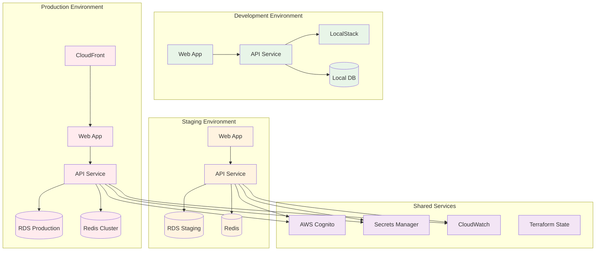

## NX Dependency Graph

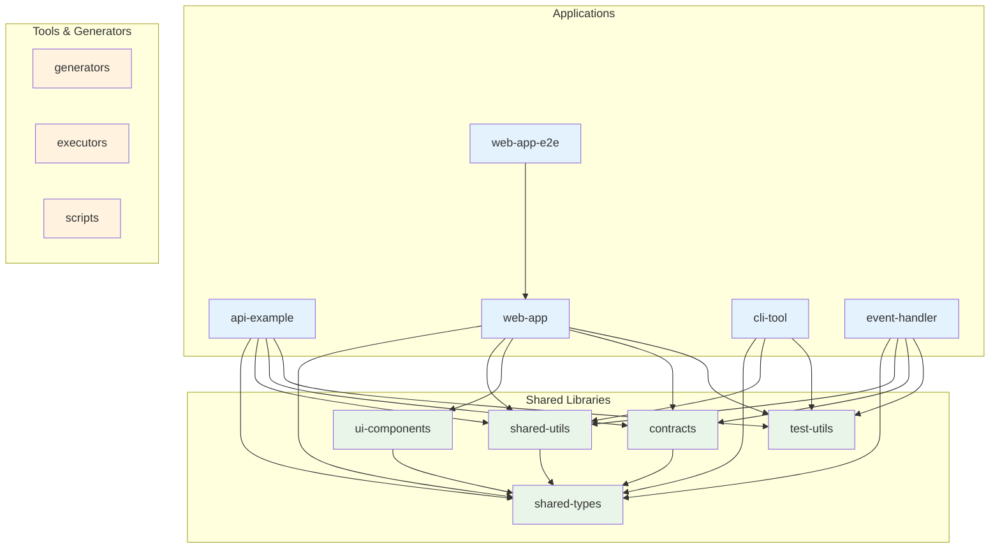

## Monitoring and Observability

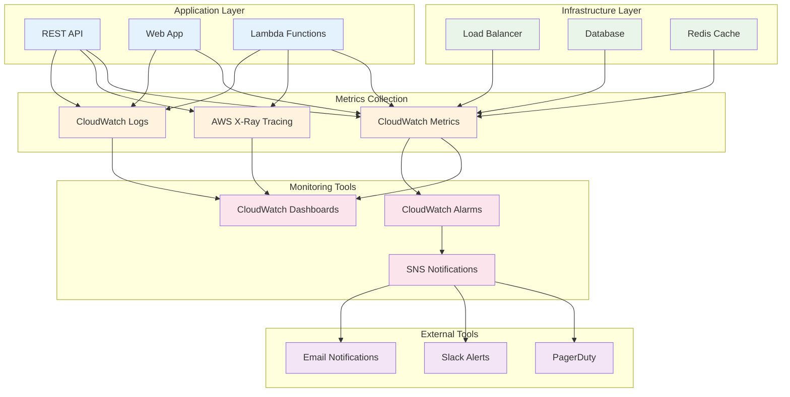

## Error Handling and Recovery

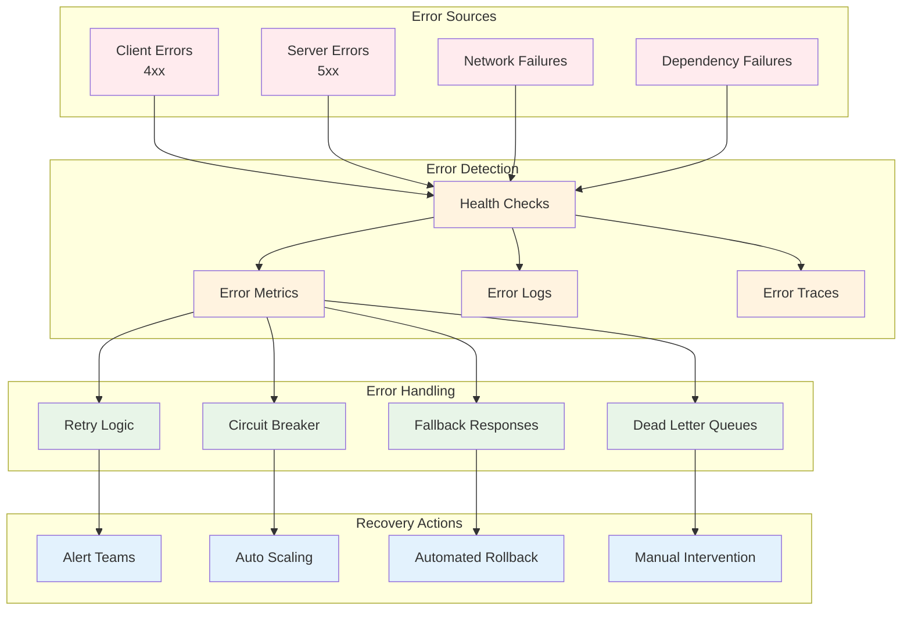

## Performance Optimization Strategy

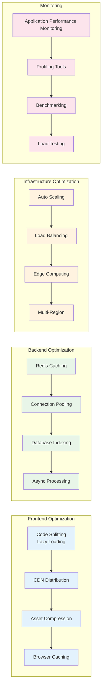

## Diagram Legend

### Color Coding
- **Blue** (e3f2fd): Client/Frontend components
- **Green** (e8f5e8): Backend services and processing
- **Orange** (fff3e0): Infrastructure and middleware
- **Pink** (fce4ec): Data storage and persistence
- **Purple** (f3e5f5): External services and security
- **Red** (ffebee): Critical or production components

### Symbol Meanings
- **Rectangles**: Services, applications, or processes
- **Cylinders**: Databases, storage, or data stores
- **Diamonds**: Decision points or gateways
- **Circles**: External systems or users
- **Dotted lines**: Optional or conditional connections
- **Solid arrows**: Direct dependencies or data flow
- **Dashed arrows**: Monitoring or observation relationships

## Tools for Diagram Creation

### Recommended Tools
1. **Mermaid**: For version-controlled diagrams in markdown
2. **Draw.io/Diagrams.net**: For detailed architectural diagrams
3. **Lucidchart**: For collaborative diagram creation
4. **PlantUML**: For UML and sequence diagrams
5. **AWS Architecture Icons**: For AWS-specific diagrams

### Diagram Maintenance
- **Version Control**: All diagrams stored in Git repository
- **Regular Updates**: Diagrams updated with architecture changes
- **Review Process**: Diagrams reviewed during architecture reviews
- **Automation**: Where possible, generate diagrams from code
- **Documentation**: Each diagram includes purpose and context

## References

- [Mermaid Documentation](https://mermaid-js.github.io/mermaid/)
- [AWS Architecture Center](https://aws.amazon.com/architecture/)
- [C4 Model for Software Architecture](https://c4model.com/)
- [ArchiMate Modeling Language](https://www.opengroup.org/archimate-forum)