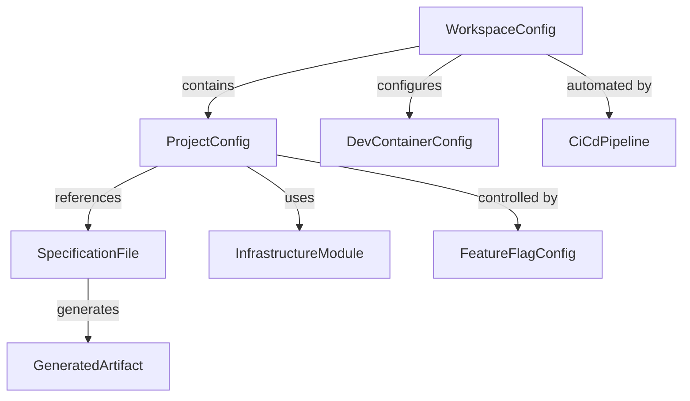
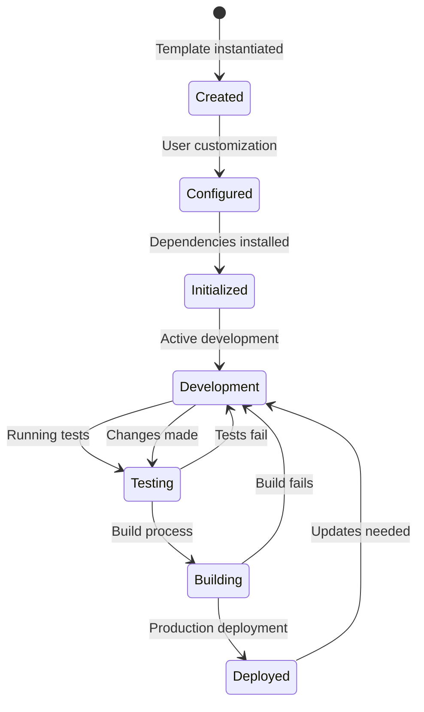

# Data Model

**Feature**: NX Monorepo Starter Template
**Date**: 2025-09-28
**Status**: Complete

## Overview
This document defines the data structures and configurations required for the NX monorepo template repository.

## Core Entities

### 1. WorkspaceConfig
**Purpose**: Root configuration for the entire monorepo
**Location**: `nx.json`, `package.json`, `pnpm-workspace.yaml`

```typescript
interface WorkspaceConfig {
  name: string;                    // Repository name
  version: string;                 // Template version (semver)
  nodeVersion: string;             // Minimum Node.js version (24+)
  packageManager: string;          // pnpm@9.x.x
  workspaces: string[];           // Workspace paths
  nxConfig: NxConfiguration;      // NX-specific settings
}

interface NxConfiguration {
  extends: string;                // Base configuration
  npmScope: string;               // NPM organization scope
  affected: {
    defaultBase: string;          // Default comparison branch
  };
  tasksRunnerOptions: {
    default: {
      runner: string;             // '@nx/workspace/tasks-runners/default'
      options: {
        cacheableOperations: string[];  // ['build', 'test', 'lint']
        parallel: number;         // Max parallel tasks
        cacheDirectory: string;   // '.nx/cache'
      };
    };
  };
  targetDefaults: Record<string, TargetConfig>;
}
```

### 2. ProjectConfig
**Purpose**: Individual project configuration within the monorepo
**Location**: `apps/*/project.json`, `packages/*/project.json`

```typescript
interface ProjectConfig {
  name: string;                   // Project name
  type: ProjectType;              // 'application' | 'library'
  sourceRoot: string;             // Source file location
  projectType: AppType;           // 'rest-api' | 'event-handler' | 'web-app' | 'cli' | 'library'
  targets: Record<string, TargetConfig>;  // Build targets
  tags: string[];                 // Project tags for grouping
  implicitDependencies?: string[]; // Hidden dependencies
}

enum ProjectType {
  APPLICATION = 'application',
  LIBRARY = 'library'
}

enum AppType {
  REST_API = 'rest-api',
  EVENT_HANDLER = 'event-handler',
  WEB_APP = 'web-app',
  CLI = 'cli',
  LIBRARY = 'library'
}

interface TargetConfig {
  executor: string;               // NX executor to use
  options: Record<string, any>;  // Executor-specific options
  configurations?: Record<string, any>;  // Environment configs
  dependsOn?: string[];          // Target dependencies
}
```

### 3. SpecificationFile
**Purpose**: API contract specifications
**Location**: `packages/contracts/*.yaml`

```typescript
interface SpecificationFile {
  type: SpecType;                // 'openapi' | 'asyncapi'
  version: string;                // Spec version (3.1.0, 2.6.0)
  filePath: string;               // Relative path to spec file
  generatedCode: GeneratedArtifact[];  // Generated code locations
}

enum SpecType {
  OPENAPI = 'openapi',
  ASYNCAPI = 'asyncapi'
}

interface GeneratedArtifact {
  type: ArtifactType;            // 'client' | 'server' | 'types' | 'docs'
  language: string;               // 'typescript' | 'python'
  outputPath: string;             // Generated file location
  generator: string;              // Generator tool used
}

enum ArtifactType {
  CLIENT = 'client',
  SERVER = 'server',
  TYPES = 'types',
  DOCUMENTATION = 'docs'
}
```

### 4. InfrastructureModule
**Purpose**: Terraform infrastructure modules
**Location**: `infrastructure/terraform/modules/*`

```typescript
interface InfrastructureModule {
  name: string;                   // Module name
  provider: CloudProvider;        // 'aws' | 'azure' | 'gcp'
  resources: TerraformResource[]; // Managed resources
  variables: TerraformVariable[]; // Input variables
  outputs: TerraformOutput[];     // Output values
}

enum CloudProvider {
  AWS = 'aws',
  AZURE = 'azure',
  GCP = 'gcp'
}

interface TerraformResource {
  type: string;                   // Resource type (aws_lambda_function)
  name: string;                   // Resource name
  configuration: Record<string, any>;  // Resource settings
}

interface TerraformVariable {
  name: string;                   // Variable name
  type: string;                   // Variable type
  description: string;            // Variable purpose
  default?: any;                  // Default value
  validation?: ValidationRule[];  // Validation rules
}

interface TerraformOutput {
  name: string;                   // Output name
  value: string;                  // Output expression
  description: string;            // Output purpose
  sensitive?: boolean;            // Hide in logs
}
```

### 5. DevContainerConfig
**Purpose**: Development container configuration
**Location**: `.devcontainer/devcontainer.json`

```typescript
interface DevContainerConfig {
  name: string;                   // Container name
  image?: string;                 // Base Docker image
  dockerFile?: string;            // Custom Dockerfile path
  features: Record<string, any>; // Dev container features
  customizations: {
    vscode: VsCodeConfig;         // VS Code settings
  };
  postCreateCommand: string;      // Setup command
  postStartCommand: string;       // Startup command
  forwardPorts: number[];        // Exposed ports
  env: Record<string, string>;   // Environment variables
}

interface VsCodeConfig {
  extensions: string[];           // Required extensions
  settings: Record<string, any>; // VS Code settings
}
```

### 6. FeatureFlagConfig
**Purpose**: Feature flag configuration
**Location**: `config/feature-flags.yaml`

```typescript
interface FeatureFlagConfig {
  provider: string;               // 'flipt'
  flags: FeatureFlag[];          // Feature flag definitions
  segments: Segment[];           // User segments
  rules: Rule[];                 // Evaluation rules
}

interface FeatureFlag {
  key: string;                   // Flag identifier
  name: string;                  // Display name
  description: string;           // Flag purpose
  enabled: boolean;              // Default state
  variants?: Variant[];          // Flag variants for A/B testing
}

interface Variant {
  key: string;                   // Variant identifier
  name: string;                  // Display name
  description: string;           // Variant purpose
  weight: number;                // Distribution weight (0-100)
}

interface Segment {
  key: string;                   // Segment identifier
  name: string;                  // Display name
  constraints: Constraint[];     // Matching rules
}

interface Rule {
  flagKey: string;               // Associated flag
  segmentKey: string;            // Target segment
  distributions: Distribution[]; // Variant distributions
  rank: number;                  // Evaluation order
}
```

### 7. CiCdPipeline
**Purpose**: GitHub Actions workflow configuration
**Location**: `.github/workflows/*.yaml`

```typescript
interface CiCdPipeline {
  name: string;                   // Workflow name
  trigger: TriggerConfig;         // When to run
  env: Record<string, string>;   // Environment variables
  jobs: Job[];                    // Workflow jobs
}

interface TriggerConfig {
  push?: {
    branches: string[];          // Branch patterns
    paths?: string[];            // File patterns
  };
  pull_request?: {
    branches: string[];
  };
  schedule?: string;             // Cron expression
  workflow_dispatch?: boolean;   // Manual trigger
}

interface Job {
  name: string;                  // Job name
  runsOn: string | string[];     // Runner type(s)
  needs?: string[];              // Job dependencies
  strategy?: {
    matrix: Record<string, any[]>; // Matrix builds
  };
  steps: Step[];                 // Job steps
}

interface Step {
  name: string;                  // Step name
  uses?: string;                 // Action to use
  run?: string;                  // Command to run
  with?: Record<string, any>;    // Action inputs
  env?: Record<string, string>;  // Step environment
}
```

## Relationships

### Entity Relationship Diagram



## State Transitions

### Project Lifecycle



## Validation Rules

### WorkspaceConfig Validation
- `name`: Must be valid npm package name
- `version`: Must follow semver
- `nodeVersion`: Must be >=24.0.0
- `packageManager`: Must start with "pnpm@9"

### ProjectConfig Validation
- `name`: Must be unique within workspace
- `sourceRoot`: Must be valid relative path
- `tags`: Must not contain spaces
- `targets`: Must include at least 'build' for applications

### SpecificationFile Validation
- OpenAPI specs must be version 3.1.0+
- AsyncAPI specs must be version 2.6.0+
- All `$ref` references must resolve
- Generated code paths must not conflict

### InfrastructureModule Validation
- Resource names must follow provider naming conventions
- Variables must have descriptions
- Sensitive outputs must be marked
- Module dependencies must form DAG (no cycles)

### DevContainerConfig Validation
- Image or Dockerfile must be specified
- Post-create command must be idempotent
- Forward ports must not conflict
- Extensions must exist in marketplace

### FeatureFlagConfig Validation
- Flag keys must be unique
- Variant weights must sum to 100
- Segment constraints must be valid
- Rules must have unique ranks

### CiCdPipeline Validation
- Job names must be unique
- Job dependencies must exist
- Matrix dimensions must have values
- Secrets must be defined in repository

## Data Persistence

### Configuration Storage
- **Workspace Config**: Version controlled in repository
- **Project Config**: Version controlled per project
- **Specifications**: Version controlled in contracts package
- **Infrastructure**: Version controlled with state in Terraform Cloud/S3
- **DevContainer**: Version controlled in .devcontainer
- **Feature Flags**: Version controlled, runtime evaluation
- **CI/CD**: Version controlled in .github/workflows

### Runtime Data
- **Build Cache**: Local `.nx/cache` directory
- **Dependencies**: Local `node_modules` via pnpm
- **LocalStack Data**: Docker volumes for persistence
- **Terraform State**: Remote backend (S3/Terraform Cloud)

## Migration Considerations

### Version Upgrades
- Workspace config migration scripts for breaking changes
- Project config backward compatibility for 2 major versions
- Specification version upgrades via spec-kit tooling
- Infrastructure module versioning with upgrade guides

### Template Evolution
- Feature flags for gradual rollout of new features
- Deprecated features marked with warnings
- Migration guides for major version changes
- Automated migration tools where possible